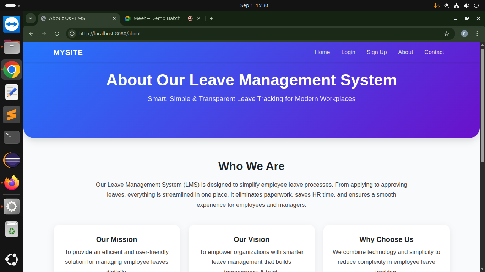

Title: Leave Management System
A Spring Boot-based Leave Management System that helps organizations manage employee leave requests, allocations, and approvals efficiently.

🚀 Features
✅ Employee Registration & Login (Spring Security)
✅ Role-based access (Admin / Employee / Manager)
✅ Apply, Approve, Reject, and Cancel Leave Requests
✅ Leave Allocation & Balance Calculation (with business rules)
✅ Employee Dashboard with leave history
✅ Frontend Integration with Thyemleaf/Bootstrap

🛠️ Tech Stack
Backend: Java 17, Spring Boot, Spring Security, Spring Data JPA, Hibernate
Frontend: Thyemleaf + Bootstrap
Database: MySQL
Build Tool: Maven
Other Tools: Lombok, Postman, Git

 ⚙️ Installation & Setup
🔧 Backend (Spring Boot)
1)Clone the repo
git clone https://github.com/your-username/leave-management-system.git
cd leave-management-system

2)Configure MySQL in src/main/resources/application.properties:
spring.application.name=lms
# ========== Database Configuration ==========
spring.datasource.url=jdbc:mysql://localhost:3306/lms?useSSL=false&serverTimezone=UTC
spring.datasource.username=root
spring.datasource.password=Root@123
spring.datasource.driver-class-name=com.mysql.cj.jdbc.Driver

# ========== JPA / Hibernate Configuration ==========
spring.jpa.hibernate.ddl-auto=update
spring.jpa.show-sql=true
spring.jpa.properties.hibernate.format_sql=true
spring.jpa.database-platform=org.hibernate.dialect.MySQL8Dialect

# ========== Logging ==========
logging.level.org.hibernate.SQL=DEBUG
logging.level.org.hibernate.type.descriptor.sql.BasicBinder=TRACE

3)Run the backend
mvn spring-boot:run

4)Backend available at:
http://localhost:8080/

📸 Screenshots / Demo

