Title: Leave Management System

A Spring Boot-based Leave Management System that helps organizations manage employee leave requests, allocations, and approvals efficiently.

🚀 Features

✅ Employee Registration & Login (Spring Security)

✅ Role-based access (Admin / Employee / Manager)

✅ Apply, Approve, Reject, and Cancel Leave Requests

✅ Leave Allocation & Balance Calculation (with business rules)

✅ Employee Dashboard with leave history

✅ Frontend Integration with Thyemleaf/Bootstrap

🛠️ Tech Stack

Backend: Java 17, Spring Boot, Spring Security, Spring Data JPA, Hibernate

Frontend: Thyemleaf + Bootstrap

Database: MySQL

Build Tool: Maven

Other Tools: Lombok, Postman, Git

📂 Project Structure

leave-management-system/

 ├── src/
 
 │   ├── main/
 
 │   │   ├── java/com/lms/                # Main source code
 
 │   │   │   ├── controller/              # Controllers
 
 │   │   │   ├── dto/                     # DTOs
 
 │   │   │   ├── entity/                  # Entities
 
 │   │   │   ├── exception/               # Custom Exceptions
 
 │   │   │   ├── repository/              # JPA Repositories
 
 │   │   │   ├── service/                 # Business Logic
 
 │   │   └── resources/

 │   │       ├── application.properties   # DB Config
 
 │   │       └── templates/               # Thymeleaf templates
 
 │   └── test/                            # Unit & Integration Tests
 
 ├── frontend/                            # React frontend
 
 ├── pom.xml                              # Maven dependencies
 
 └── README.md

 ⚙️ Installation & Setup
 
🔧 Backend (Spring Boot)

1)Clone the repo

git clone git@github.com:SurajGhodge/lms.git

cd leave-management-system

2)Configure MySQL in src/main/resources/application.properties:

spring.application.name=lms

# ========== Database Configuration ==========

spring.datasource.url=jdbc:mysql://localhost:3306/lms?useSSL=false&serverTimezone=UTC

spring.datasource.username=root

spring.datasource.password=Root@123

spring.datasource.driver-class-name=com.mysql.cj.jdbc.Driver

# ========== JPA / Hibernate Configuration ==========

spring.jpa.hibernate.ddl-auto=update

spring.jpa.show-sql=true

spring.jpa.properties.hibernate.format_sql=true

spring.jpa.database-platform=org.hibernate.dialect.MySQL8Dialect

# ========== Logging ==========

logging.level.org.hibernate.SQL=DEBUG

logging.level.org.hibernate.type.descriptor.sql.BasicBinder=TRACE

3)Run the backend

mvn spring-boot:run

4)Backend available at:

http://localhost:8080/

📸 Screenshots / Demo

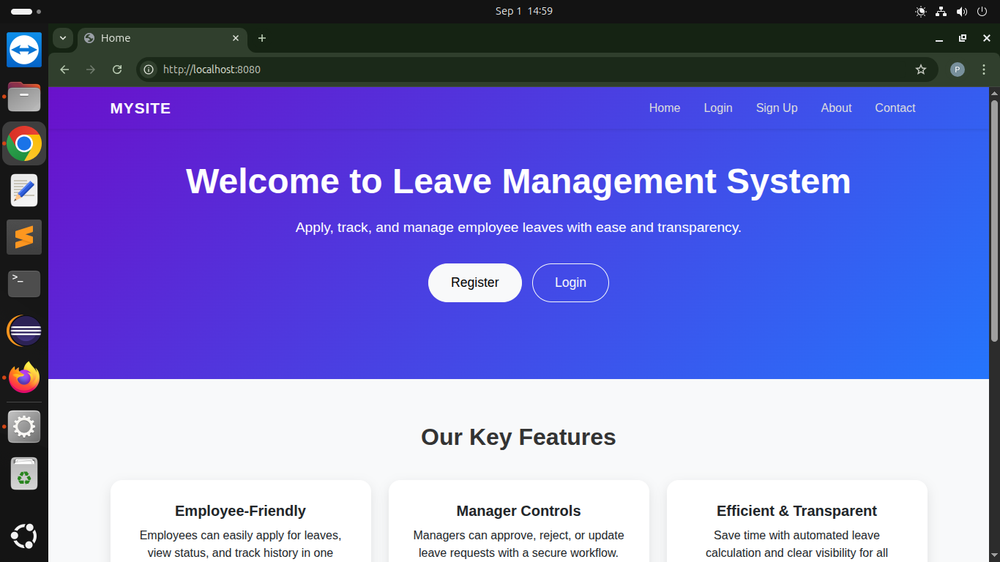
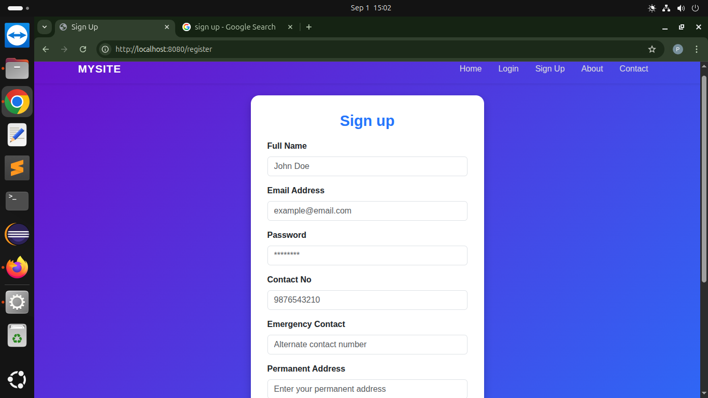
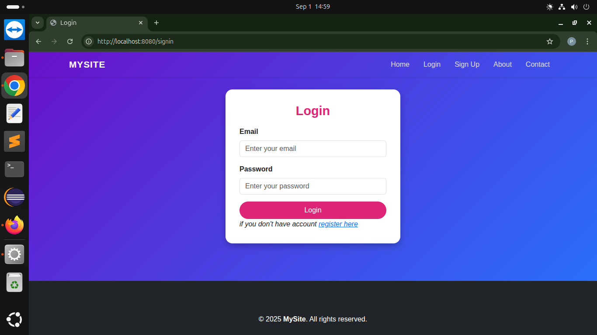
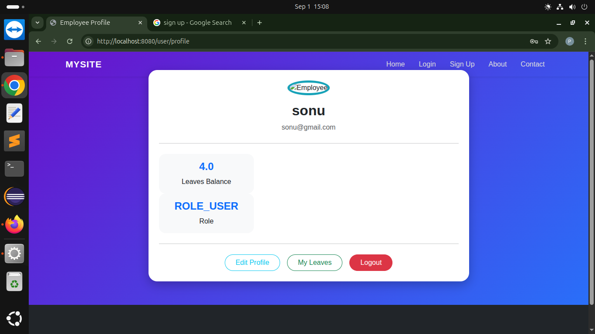
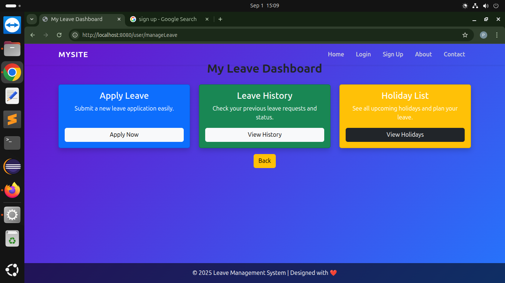
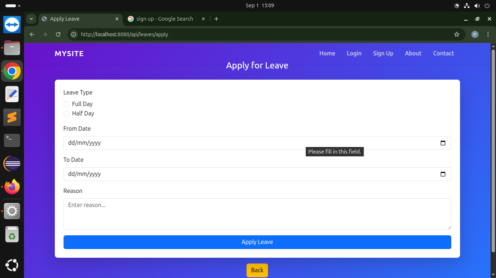
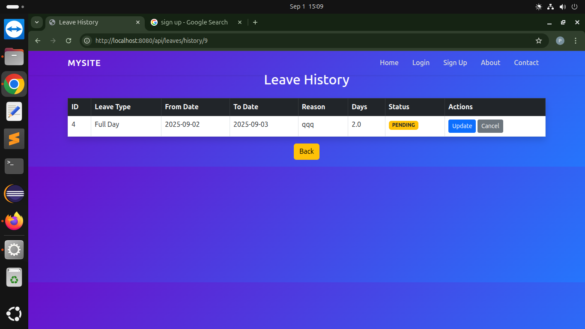
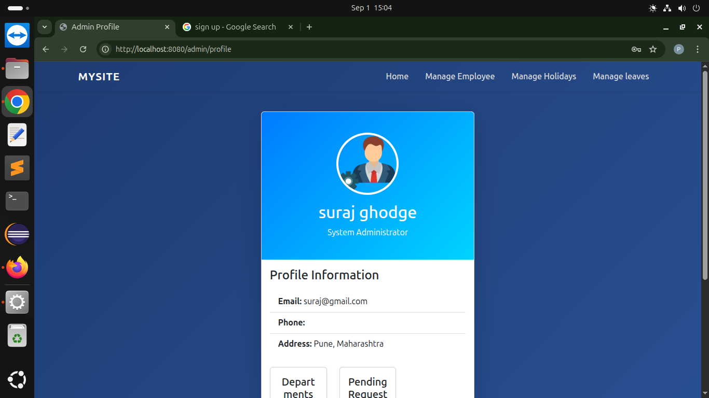

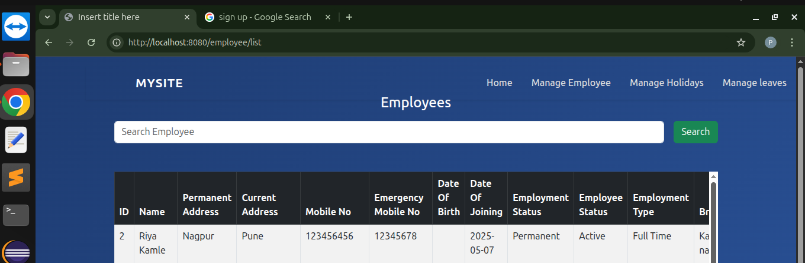
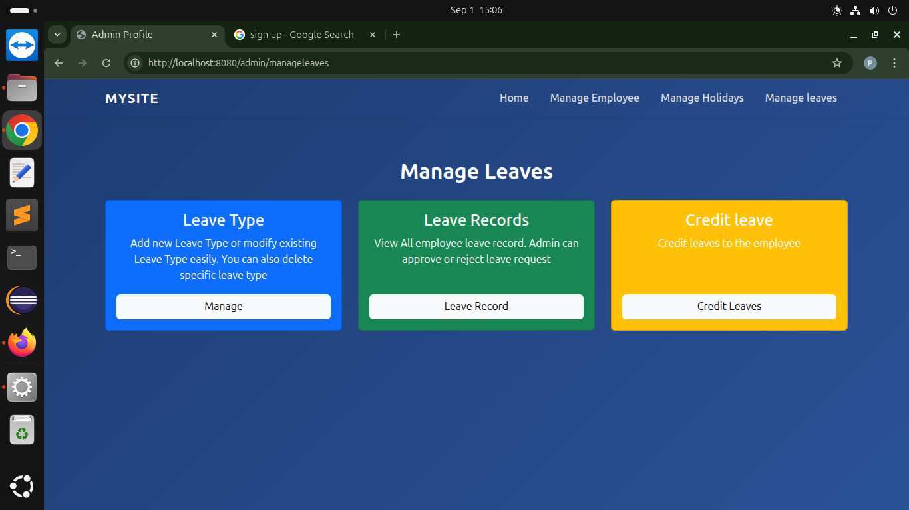
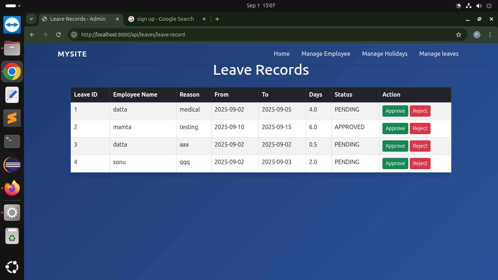
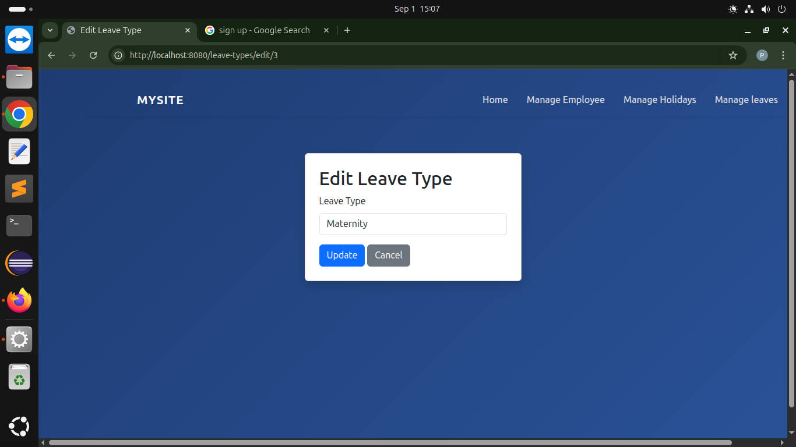
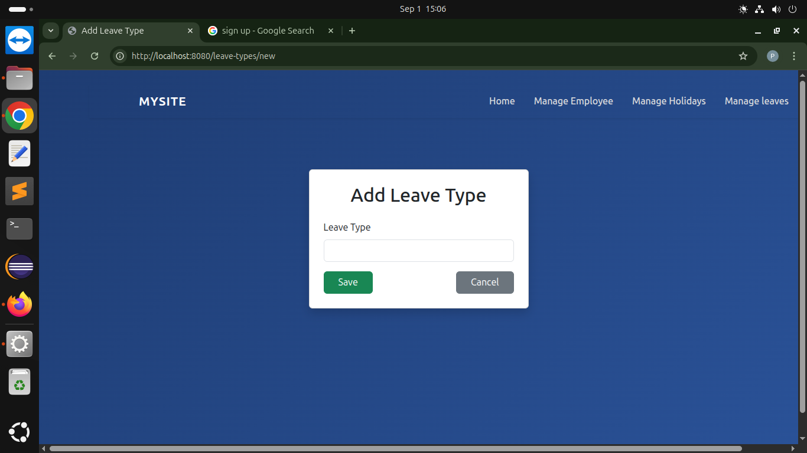
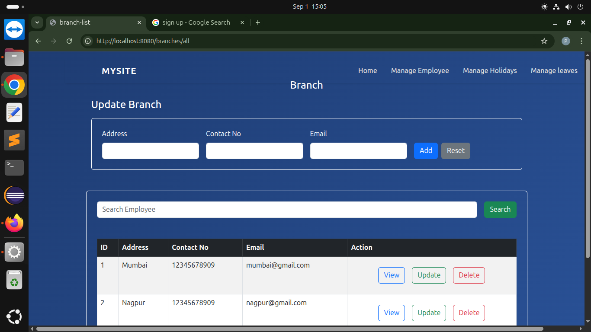
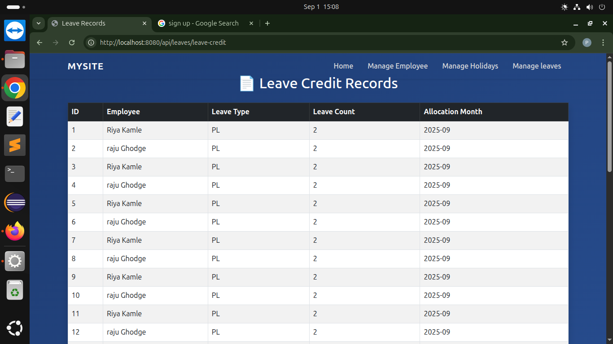

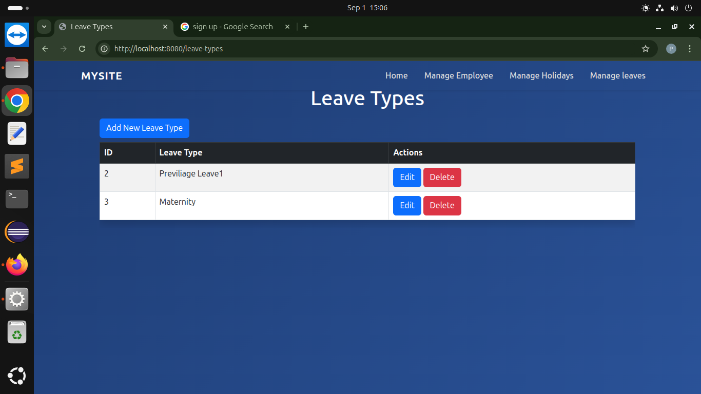
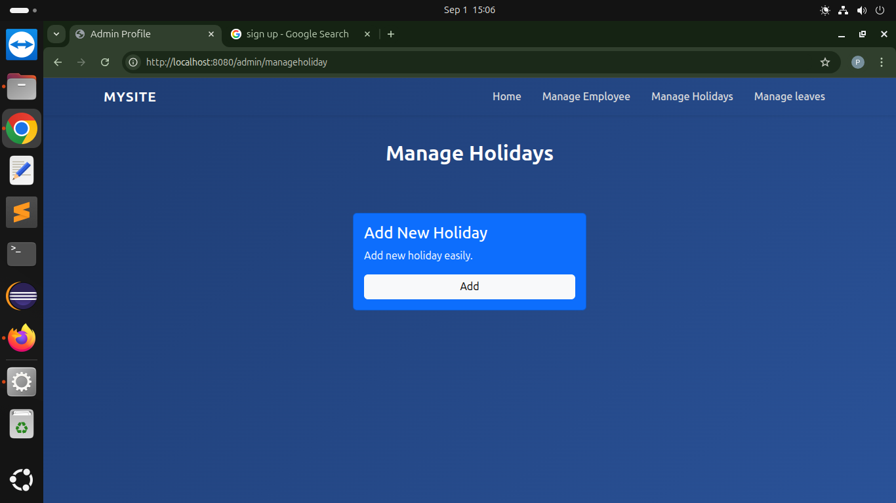

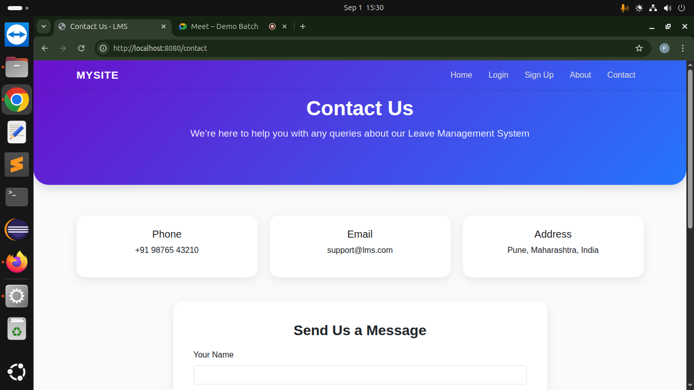
